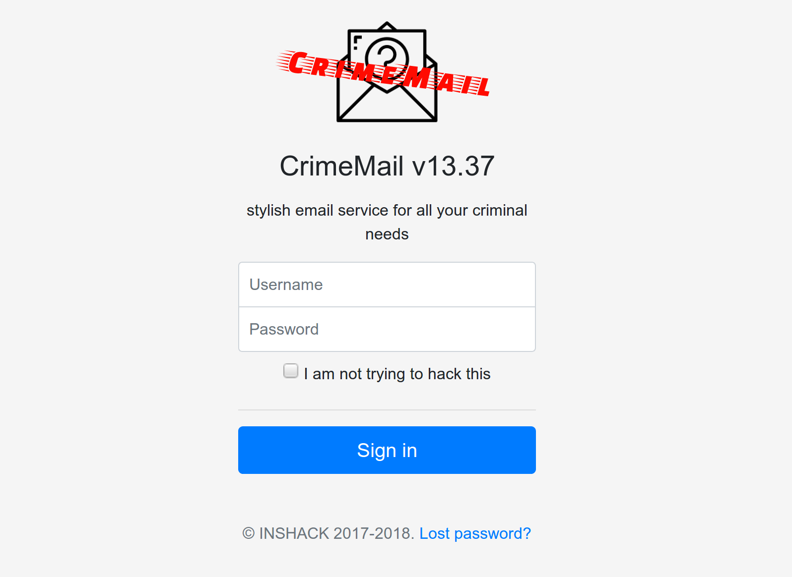
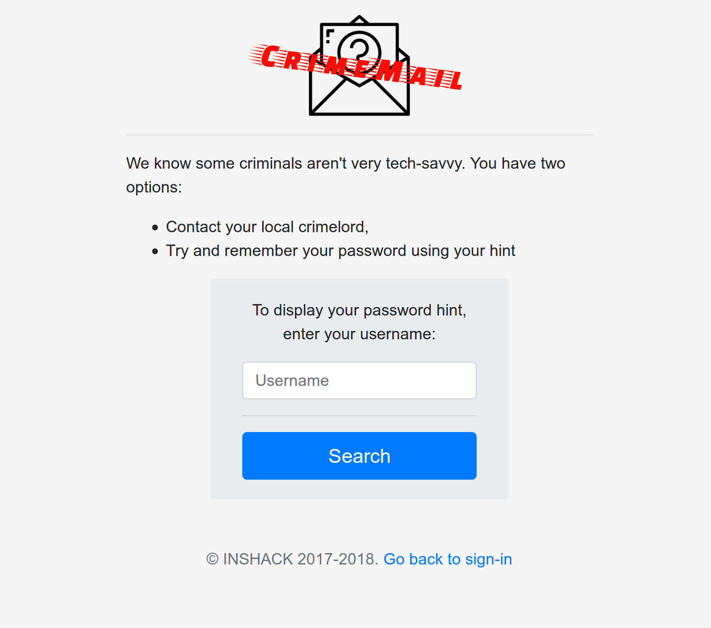
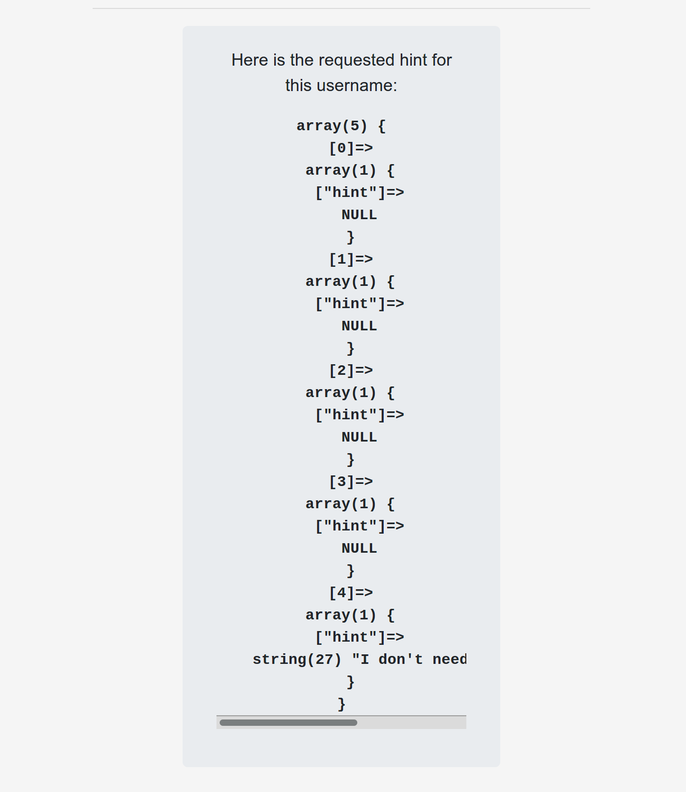
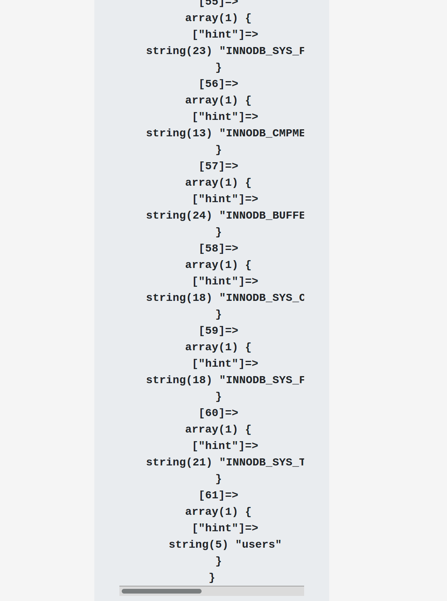
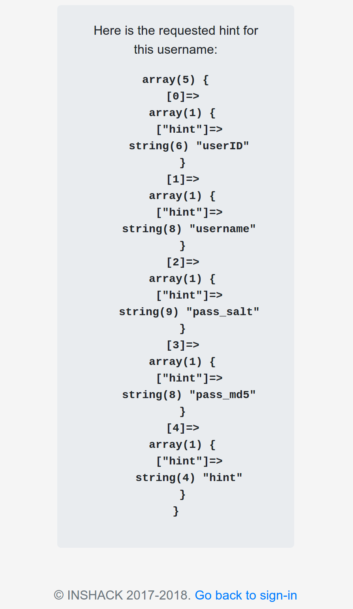
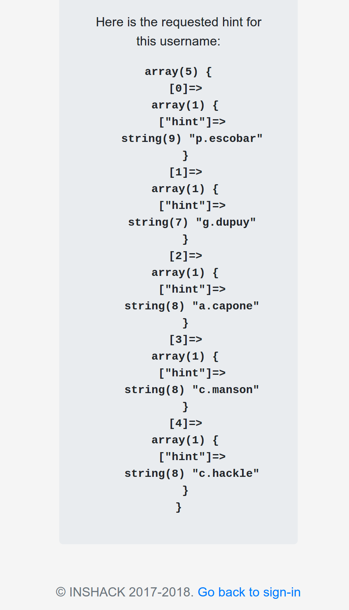
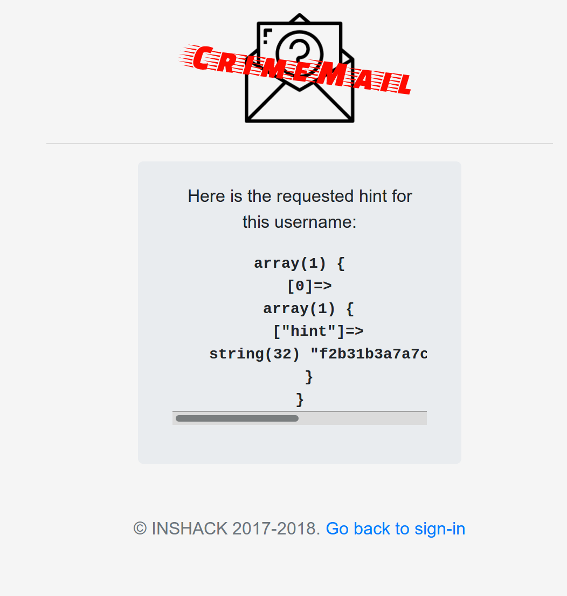
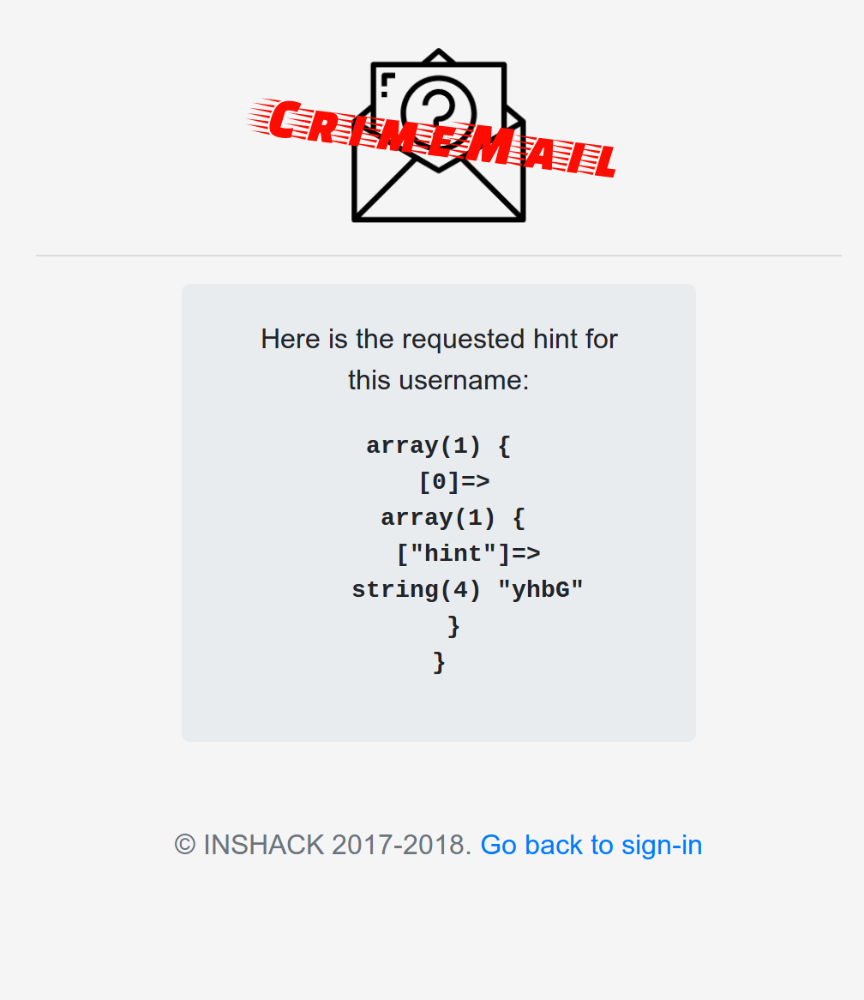
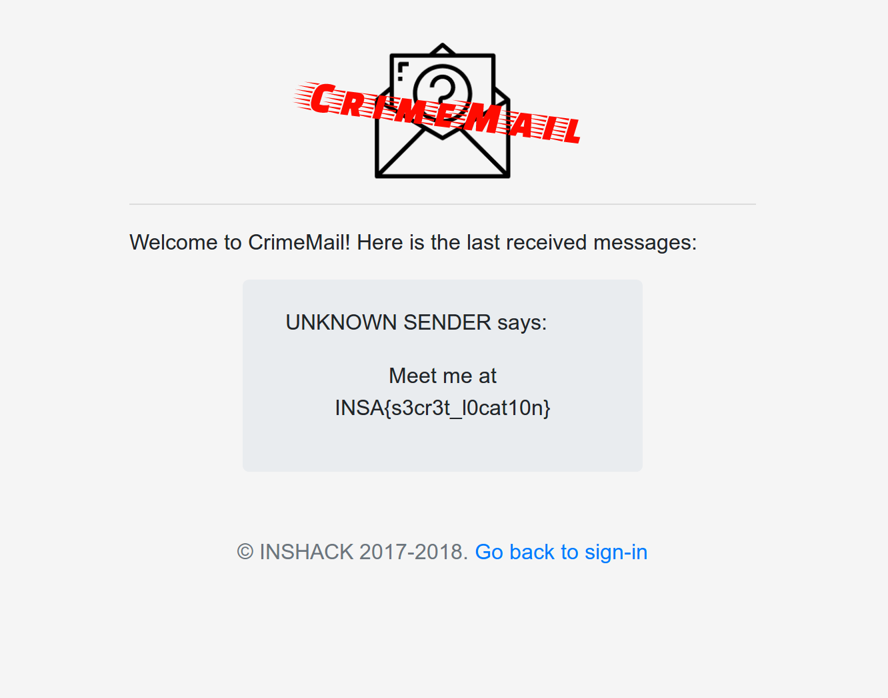

<h1>INS'HACK 2018 Crimemail Writeup</h1>
<h3>Authored by Chase of Jolly Roger Insecurity</h3>

<strong>challenge description:</strong> Collins Hackle is a notorious bad guy, and you've decided to take him down. You need something on him, anything, to send the police his way, and it seems he uses CrimeMail, a very specialized email service, to communicate with his associates. 

Let's see if you can hack your way in his account... 

Hint: his password's md5 is computed as followed: md5 = md5($password + $salt) and Collins Hackle has a password which can be found in an english dictionary 

We arrive at this login page:

and we realize that we don't even know Collin Hackle's username. This is an indication that SQL injection is likely to used. We quickly see that there is a forgotten password page. Maybe there's something we can work with in there.

Here we have a text field that takes a username and returns a password hint. Let's try a simple line of SQL injection to see if it's vulnerable. Let's try <code>' or 1=1 -- </code><em> be sure to include the extra space after the dashes

Voila! We got some null data back which is a good sign. Let's start trying to identify other tables in the database. The following query works against a MySQL database, but at this point we don't technically know if it even is MySQL: <code>' UNION SELECT table_name FROM information_schema.tables;-- </code>

So it is in fact MySQL. Buried at the bottom of the output, past all of the 'meta' tables generated by MySQL is one 'user' table. This must contain some important data. Let's try to get the column names with the following: <code>' UNION SELECT COLUMN_NAME FROM INFORMATION_SCHEMA.COLUMNS WHERE TABLE_NAME = 'users';-- </code>

Great! We know the columns in the users table, now we can start extracting user specific data. The next thing we need is to find Collin's username, and with nothing to go on, we may as well pull out all usernames: <code>' UNION SELECT username FROM users;-- </code>

There it is, 'c.hackle'. Now what about the pass_md5? <code>' UNION SELECT pass_md5 FROM users WHERE username = 'c.hackle';-- </code>

...and the salt: <code>' UNION SELECT pass_salt FROM users WHERE username = 'c.hackle';-- </code>

 
 

We now know quite a bit of information: the username, md5 password hash, and md5 salt. This is enough to start cracking his password.
 The handy hint from the challenge description lets us know that a standard wordlist of English words would contain the password.
 Jolly Roger Insecurity team member Eric quickly wrote up <a href='./pwncrackctf.py' target='_blank'>this python program</a> to hash words from a wordlist and compare them to the password hash. 

We found a match on the word 'pizza'! Let's head over to the login page, entering username 'c.hackle' and password 'pizza'...

