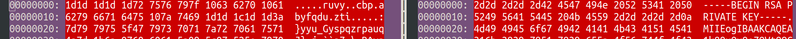

# Music is Frequency

INS'HACK 2018

Category: Crypto

## Challenge text

> Passionated by the sound of a nursery rhyme, we decided to build a new way to send private messages.
> 
> Find a way to decrypt our rsa private key to get your reward.
> 
> Because we are pretty bad musicians, we have decided to not take into account any rhythm and to round all used number to the closest.

## Files

[music-is-frequency.zip](music-is-frequency.zip)

## Notes

Unzipping provides:

```
./public-files
./public-files/frere_jacques.pdf
./src
./src/flag.enc
./src/privatekey.bin
```

`flag.enc` is base64 encoded, decode with `base64 -d flag.enc > flag`

Still need to decrypt. `privatekey.bin` should be an RSA Private key, but it has been modified somehow.

We know that an RSA private key (in PEM format) is ASCII and has a known header and footer. A common example is `~/.ssh/id_rsa`, let's use that to compare.

Known header is 48 bytes (also known footer, can use to confirm if the end is correct also)

## Compare

On the left is `privatekey.bin`, on the right is `id_rsa` (only the header, no you can't have my private key)



Here we can see how `2d` maps to `1d` so that's how the dashes got transformed, similar pattern for `BEGIN RSA PRIVATE KEY`

`0x2d ^ 0x1d` is `0x30`, `0x42 ^ 0x72` is the same, and so on

## Investigating further...

see [xor_bytes.py](xor_bytes.py)

run with `python xor_bytes.py src/privatekey.bin ~/.ssh/id_rsa 48`

Note each of these 48 bytes has been XORed with either `0x30` or `0x31`

### output

```
byte 0x0 : 0x1d XOR 0x2d == 0x30
byte 0x1 : 0x1d XOR 0x2d == 0x30
byte 0x2 : 0x1d XOR 0x2d == 0x30
byte 0x3 : 0x1d XOR 0x2d == 0x30
byte 0x4 : 0x1d XOR 0x2d == 0x30
byte 0x5 : 0x72 XOR 0x42 == 0x30
byte 0x6 : 0x75 XOR 0x45 == 0x30
byte 0x7 : 0x76 XOR 0x47 == 0x31
byte 0x8 : 0x79 XOR 0x49 == 0x30
byte 0x9 : 0x7f XOR 0x4e == 0x31
byte 0xa : 0x10 XOR 0x20 == 0x30
byte 0xb : 0x63 XOR 0x52 == 0x31
byte 0xc : 0x62 XOR 0x53 == 0x31
byte 0xd : 0x70 XOR 0x41 == 0x31
byte 0xe : 0x10 XOR 0x20 == 0x30
byte 0xf : 0x61 XOR 0x50 == 0x31
byte 0x10: 0x62 XOR 0x52 == 0x30
byte 0x11: 0x79 XOR 0x49 == 0x30
byte 0x12: 0x66 XOR 0x56 == 0x30
byte 0x13: 0x71 XOR 0x41 == 0x30
byte 0x14: 0x64 XOR 0x54 == 0x30
byte 0x15: 0x75 XOR 0x45 == 0x30
byte 0x16: 0x10 XOR 0x20 == 0x30
byte 0x17: 0x7a XOR 0x4b == 0x31
byte 0x18: 0x74 XOR 0x45 == 0x31
byte 0x19: 0x69 XOR 0x59 == 0x30
byte 0x1a: 0x1d XOR 0x2d == 0x30
byte 0x1b: 0x1d XOR 0x2d == 0x30
byte 0x1c: 0x1c XOR 0x2d == 0x31
byte 0x1d: 0x1d XOR 0x2d == 0x30
byte 0x1e: 0x1d XOR 0x2d == 0x30
byte 0x1f: 0x3a XOR 0xa  == 0x30
byte 0x20: 0x7d XOR 0x4d == 0x30
byte 0x21: 0x79 XOR 0x49 == 0x30
byte 0x22: 0x79 XOR 0x49 == 0x30
byte 0x23: 0x75 XOR 0x45 == 0x30
byte 0x24: 0x5f XOR 0x6f == 0x30
byte 0x25: 0x47 XOR 0x67 == 0x20
byte 0x26: 0x79 XOR 0x49 == 0x30
byte 0x27: 0x73 XOR 0x42 == 0x31
byte 0x28: 0x70 XOR 0x41 == 0x31
byte 0x29: 0x71 XOR 0x41 == 0x30
byte 0x2a: 0x7a XOR 0x4b == 0x31
byte 0x2b: 0x72 XOR 0x43 == 0x31
byte 0x2c: 0x70 XOR 0x41 == 0x31
byte 0x2d: 0x61 XOR 0x51 == 0x30
byte 0x2e: 0x75 XOR 0x45 == 0x30
byte 0x2f: 0x71 XOR 0x41 == 0x30
```

## Open Questions

* What is the pattern of these bytes?
* Does the song *Frère Jacques* have something to do with the pattern?
    * I am thinking maybe look at the frequencies of the notes? (starting with F4, the F above middle C)
    * Maybe use https://pages.mtu.edu/~suits/notefreqs.html

If we can figure out the correct pattern of `0x30` and `0x31` bytes, we can XOR the rest of the `privatekey.bin` and then use that to decrypt `flag` !

## Notes / frequencies

Frère Jacques in the PDF is in the key of F major, time signature 2/4 (cut time aka alla breve)

First two measures are:
(the text above seems to hint that frequencies will be rounded?)

| note | frequency (Hz) | rounded freq | wavelength (cm) | rounded λ |
| ---- | -------------- | ------------ | --------------- | --------- |
| F4   | 349.23		| 349		| 98.79 | 99 |
| G4   | 392.00		| 392		| 88.01 | 88 |
| ---- | -------------- | ------------ | --------------- | --------- |
| A4	| 440.00	| 440		| 78.41 | 78 |
| F4   | 349.23         | 349		| 98.79 | 99 |
| ---- | -------------- | ------------ | --------------- | --------- |

Thanks to Caitlin for reading the whole chart and providing frequencies!


## Decode key


run as `python3 ./xor_notes.py src/privatekey.bin decoded_privkey.pem 1674`

seems to be a good key (tested with `openssl asn1parse < decoded_privkey.pem`)

## Now use the key with `openssl`

IT SHOULD WORK! but it isn't. using:

`openssl rsautl -decrypt -inkey decoded_privkey.pem -in src/flag  -out flag-decrypted`

```
RSA operation error
140693057825536:error:0407109F:rsa routines:RSA_padding_check_PKCS1_type_2:pkcs decoding error:rsa_pk1.c:273:
140693057825536:error:04065072:rsa routines:RSA_EAY_PRIVATE_DECRYPT:padding check failed:rsa_eay.c:602:
```

What's wrong??? help!!

### the fix

Great source of info: previous CTF writeups! https://www.serraabak.com/notes/TAMUctf-RE-BandAid

> Cue me spending another half a day trying to figure out how to get the padding right. I’m learning guys, but the process is painful. I spend half a day looking through StackOverflow for someone’s solution for this error. Not once does it occur to me to just look at the man files. Never assume StackOverflow has answered everything, rookie mistake. At last it occurred to me that I should look up the manual page.

This is actually buried in `man rsautl` (part of *openssl*)

```
-pkcs, -oaep, -ssl, -raw
the padding to use: PKCS#1 v1.5 (the default), PKCS#1 OAEP, special padding used in SSL v2 backwards compatible handshakes, or no padding, respectively. For signatures, only -pkcs and -raw can be used.
```

## Solved!

`openssl rsautl -decrypt -inkey decoded_privkey.pem -in src/flag  -out flag-decrypted -raw`

simply needed the `-raw` flag!
