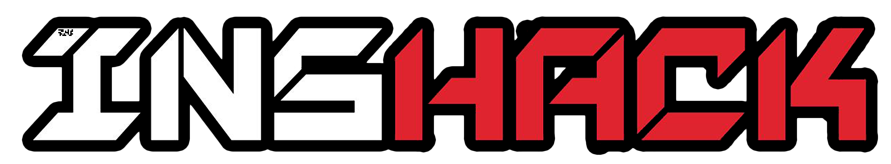

# Self congratulation

**Category**: misc

> This website is pretty cool, right? I mean, we did a pretty good job esthetically and stuff, huh?
> Please submit as `INSA{insert string found here}

## images

`logo_inshack_2018.png` provided in challenge is slightly different
than `logo_inshack_2018.png` on the actual website https://ctf.insecurity-insa.fr/

### difference

ImageMagick has a nice tool for visually comparing two images. It helps here.

diff them with: `compare logo_inshack_2018.png logo_inshack_2018-chal.png -compose src diff.png`

So what do we do with this data?

## extracting pixels ....

not sure if this is useful yet...

`binwalk` etc etc

`zlib-flate -uncompress < 29.zlib`

or the other way to uncompress raw zlib, fake a gzip header:

`printf "\x1f\x8b\x08\x00\x00\x00\x00\x00" | cat - 29.zlib | gzip -dc > output`
