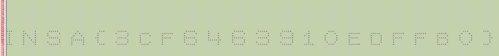

# Spreadshit

Category: misc

> This spreadsheet doesn't contain anything interesting... Or does it ? Hint : Format is INSA{[a-z0-9]\*}

## initial look

ran file through `binwalk`, looked at metadata... found something but it turned out to be ....

### decoy flag

in png metadata:

`INSA{Nice try but the flag is not here. :p}`

## open spreadsheet

looks empty. But maybe we just can't see anything, is it offscreen? is it whitespace?

export as CSV or text or something ... spaces will be quoted in double-quotes. So yes
we have some cells with single spaces in them!

### commandline tools

spent a while messing with stuff like:

`cat spreadshit.csv | sed 's/" "/*/g' | sed 's/,/ /g'`

```
* * *  *      *   * * * * *      *       * * *   * * * * *                  * * * * *   *         * * * * *    * * * * *    * * * * *     *      * * *                                         * * *    * * *  
 *   * *     *  *      *    *  *     *     *      *   * * * *   * * * * * *  *      *  *     *   *      *  *      *  *      *   * *     *    *   * * * * * *  * * * * *   * * * * * *  * * * * * *  * * * * *    *    *      * 
 *   *  *    *  *         *    *    *           *  *     *  *       *        *     *   *              *  *      *  *  *    *      *  *       *     *  *       *       *     *  *      *     * 
 *   *   *   *   * * * * *   *      *  * *      * * * * *   *       * * * * *   * * * * * *   *     *   * * * * * *    * * * * *    * * * * * *    *    *      *  * * * * *   *     *  * * * * *   * * * * *   * * * * *   *      *     * *
 *   *    *  *        *  * * * * * * *   *           *  *       *       *      *  * * * * * * *  *      *        *        *    *    *      *  *       *     *  *       *       *     *  *      *     * 
 *   *     * *  *      *  *      *   *     *      *  *     *  *       *      *       *   *      *  *      *  *      *    *     *    *   *       *     *  *       *       *     *   *    *      * 
* * *  *      *   * * * * *   *      *    * * *   * * * * *    * * * *   *        * * * * *        *    * * * * *    * * * * *    * * * * *   * * * * *    * * *    * * * * * *  * * * * *   *       *       * * * * *     * * *    * * *  
```
 
kinda looks like "INSA" but hard to make out.

Turned out we're better off just using the spreadsheet program... used search/replace function in **gnumeric**, replaced spaces with stars, got it



## FLAG

was unclear if those were capital letters or lower case. They are lower case:

`INSA{3cf6463910edffb0}`
