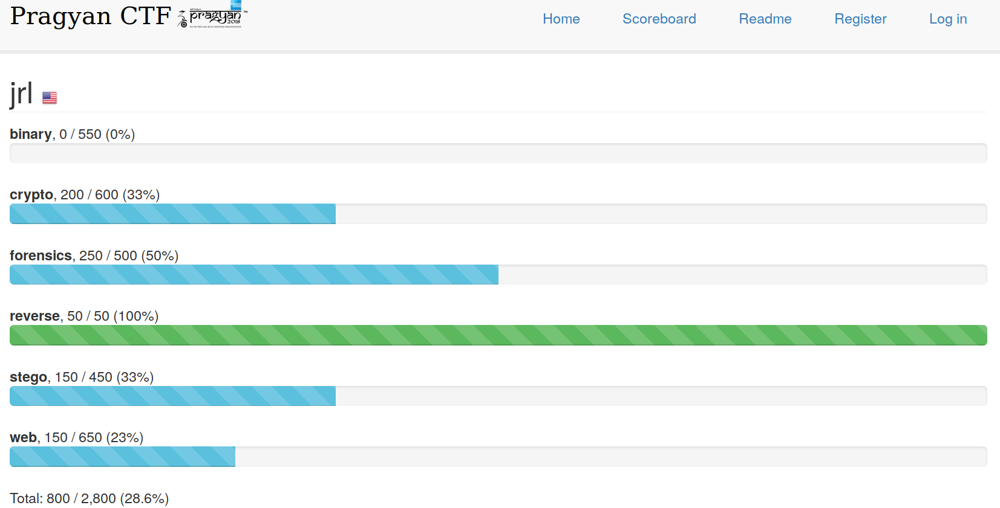
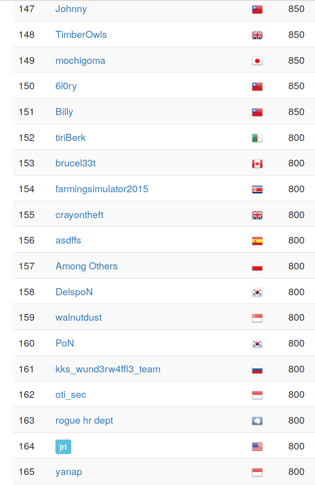
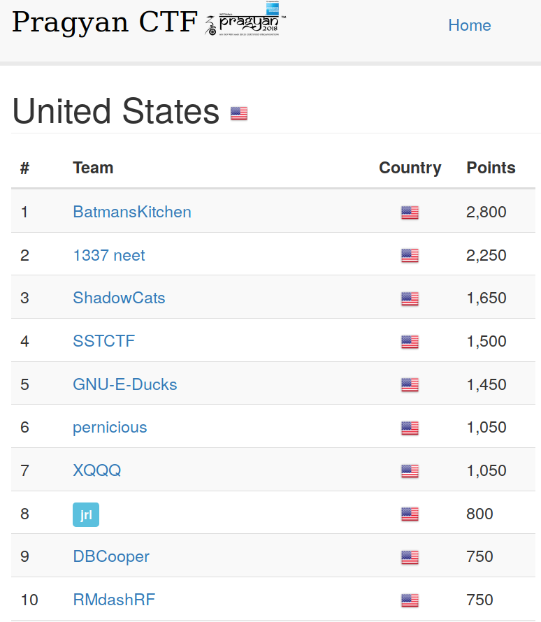

# Pragyan CTF

Pragyan CTF is a capture the flag event developed completely by the students of NIT Trichy that is open to college students all over the world.

Registration is open!

For more information, check out https://ctf.pragyan.org/content?show=readme

## Dates

Friday March 2 - Sunday March 4

## UNO team

We competed as `jrl` (created by Manish), there was also a team `jri` created by Chase but we did not use that one.

## Results

* Team results: https://ctf.pragyan.org/user?id=579

### Solved challenges

| Challenge | Solved | Points |
| --------- | ------ | ------ |
|Scientist’s research (stego) |#251, 1 day, 1 hour after release (2018-03-04 05:35:26) | 150 |
|Authenticate your way to admin (web) |#312, 1 day, 19 hours after release (2018-03-04 02:56:11) |150|
|Ears to the rescue (forensics) |#24, 21 hours, 6 minutes after release (2018-03-03 04:22:30) |150|
|Quite an EC task (crypto) |#78, 20 hours, 50 minutes after release (2018-03-03 02:32:45) |200|
|Assemble your way to the flag (reverse) |#265, 13 hours, 7 minutes after release (2018-03-02 21:59:20) |50|
|Quick Response (forensics) |#320, 15 hours after release (2018-03-02 21:36:57) |100|

### Standings

#### Overall

Rank #164 (Total teams: 1323 , teams >0 points: 606)

#### US-based teams

Rank #8 (Total US teams: 140, teams >0 points: 61)

